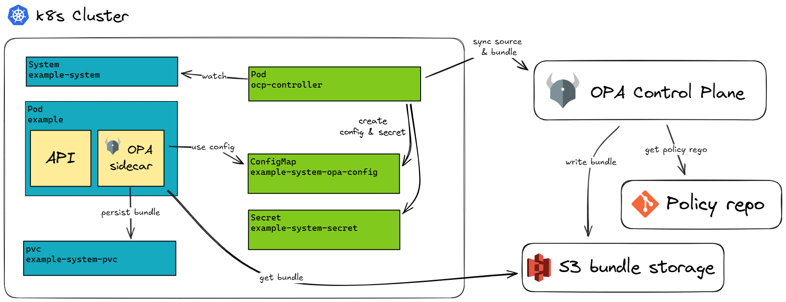

# ocp-controller

ocp-controller is a Kubernetes controller first designed to automate configuration of Styra DAS, later rewritten to configure [OPA Control Plane](https://github.com/open-policy-agent/opa-control-plane). 
With the use of 
[CustomResourceDefinitions](https://kubernetes.io/docs/concepts/extend-kubernetes/api-extension/custom-resources/),
ocp-controller enables sources and bundles to be configured, without
a manual process. By doing this we can guarantee that no changes are done to OPA Control Plane manually, which makes change management and compliance easier.

In order to ease configuration of OPA [OPA](https://github.com/open-policy-agent/opa), the controller automatically creates ConfigMaps and Secrets which contain the configuration and connection details for these components. The controller creates credentials for each unique system/bundle in s3.

## Architectural overview

ocp-controller sits in a Kubernetes cluster and ensures that sources and
bundles are created in OPA Control Plane. It then creates ConfigMaps and Secrets
with relevant configuration and connection details.

<picture>
  <source media="(prefers-color-scheme: dark)" srcset="./docs/images/ocp-controller-arch.dark.excalidraw.png">
  
</picture>

## CustomResourceDefinitions

A core feature of the ocp-controller is to monitor the Kubernetes API
server for changes to specific objects and ensure that the current OPA Control Plane
resources match these objects. The controller acts on the following custom
resource definitions (CRDs).

- `System`, which defines a OPA Control Plane source configuration and its bundle.
- `Library`, which defines a Library resource in OPA Control Plane.

For more information about these resources, see the 
[design document](docs/design.md) or the full [api reference](docs/apis).

## Installation 

For a guide on how to install ocp-controller, see 
[the installation instructions](docs/installation.md).

## Limitations

The ocp-controller is in late 2025 refactored to accommodate the needs we had in Bankdata, while migrating from Styra DAS to OPA Control Plane. This means that the feature set currently has some limitations. The following is a few of the most important ones.

- Only supports OCP ObjectStorage: AmazonS3 (at first only MinIO is supported)
- Stacks are currently unsupported

These limitations merely reflect the current state, and we might change them and add new features when the need for them arises. If you want to help removing any of these limitations, feel free to open an issue or submit a pull request.

## Contributing

For a guide on how to contribute to the ocp-controller project as well as how
to deploy the ocp-controller for testing purposes see
[CONTRIBUTING.md](CONTRIBUTING.md).

## Security

For more information about the security policy of the project see [SECURITY.md](SECURITY.md)
