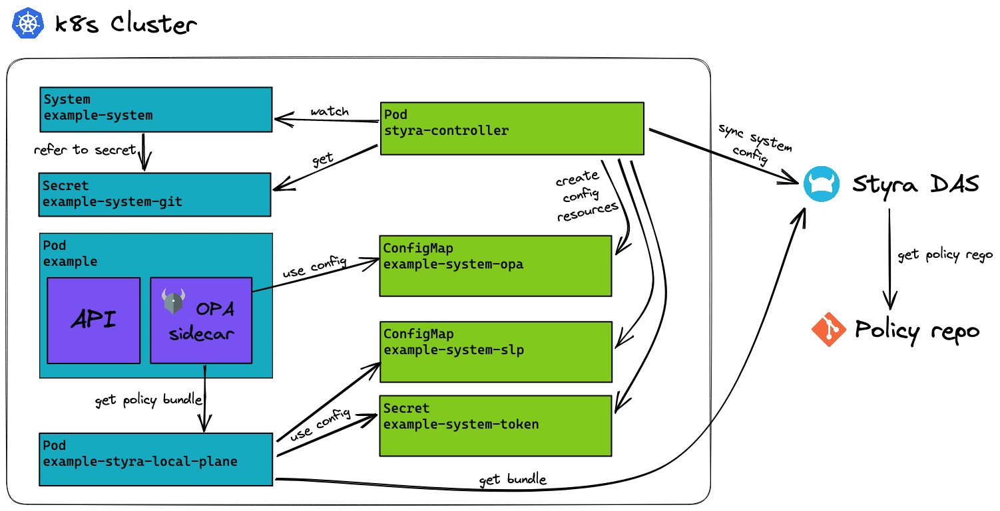

# styra-controller

styra-controller is a Kubernetes controller designed to automate configuration
of [Styra DAS](https://www.styra.com/styra-das/). With the use of 
[CustomResourceDefinitions](https://kubernetes.io/docs/concepts/extend-kubernetes/api-extension/custom-resources/),
styra-controller enables systems and datasources to be configured, without
having to do it through the GUI. By doing this we can gurantee that no changes
are done to Styra DAS manually, which makes change management and compliance
easier.

In order to ease configuration of OPA and
[Styra Local Plane (SLP)](https://docs.styra.com/das/policies/policy-organization/systems/use-styra-local-plane),
the controller automatically creates ConfigMaps and Secrets which contain the
configuration and connection details for these components.

## Arcitectural overview

styra-controller sits in a Kubernetes cluster and ensures that systems and
datasources are created in Styra DAS. It then creates ConfigMaps and Secrets
where relevant configuration and connection details can be read.

<picture>
  <source media="(prefers-color-scheme: dark)" srcset="./docs/images/controller-arch.dark.excalidraw.png">
  
</picture>

## CustomResourceDefinitions

A core feature of the styra-controller is to monitor the Kubernetes API
server for changes to specific objects and ensure that the current Styra DAS
resources match these objects. The controller acts on the following custom
resource definitions (CRDs).

- `System`, which defines a Styra DAS system configuration, its datasources and
  users with access.
- `GlobalDatasource`, which defines a global datasource resource in Styra DAS.

For more information about these resources see the 
[design document](docs/design.md) 
or the full 
[api reference](docs/apis).

## Installation 

For a guide on how to install styra-controller see 
[the installation instructions](docs/installation.md).

## Limitations

The styra-controller is a rather new project made to accomodate the needs we
have in Bankdata. This means that the feature set currently has some
limitations. The following is a few of the most important ones.

- Only supported datasource category for `GlobalDatasource` is `git/rego`
- Only supported datasource category for datasources added to systems is `rest`
- Git ssh auth is not supported
- Only supported system type is `custom`
- Stacks are currently unsupported

These limitations merely reflect the current state, and we might change them
and add new features when the need for them arises. If you want to help
removing any of these limitations feel free to open an issue or submit a pull
request.

## Contributing

For a guide on how to contribute to the styra-controller project as well as how
to deploy the styra-controller for testing purposes see
[CONTRIBUTING.md](CONTRIBUTING.md).

## Security

If you find a security vulnerability related to the styra-controller project,
please do not report it by opening a GitHub issue, but instead please write an
email explaining the issue and send it to mim@bankdata.dk.
